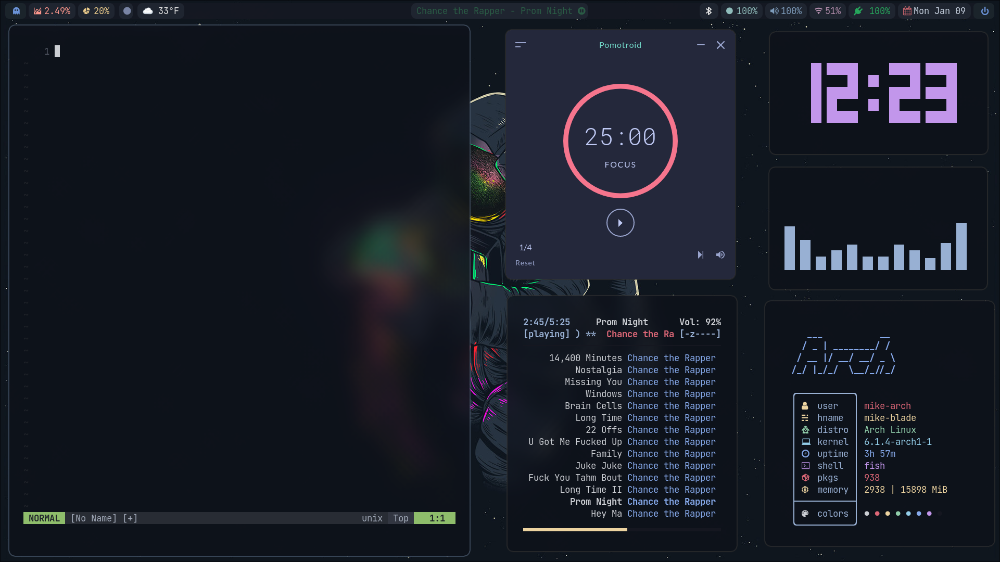

# Dotfiles

## Here are my dotfiles for my Arch Linux Rice using Hyprland.

### Screenshots



# Setup:

- Fist install the newest [Hyprland](https://hyprland.org) using this [guide](https://wiki.hyprland.org/Getting-Started/Installation/) depending on your Distro:

```zsh
paru -S hyprland-git
```

- Install Rofi, Dunst, Waybar, Kitty Terminal, Swaybg, Swaylock-effects, Swayidle, Pamixer, Light, Brillo, Wayland Clipboard, Cava, Starship:

```
paru -S rofi dunst waybar-hyprland-git kitty swaybg swaylock-effects swayidle pamixer light brillo wl-clipboard cava starship
```
- Install a Browser 

```
paru -S librewolf-bin brave-bin
```

- Other Utilities:
    - For screenshots tools to work you have to install grim, swappy, slurp:
    ```
    paru -S grim swappy slurp
    ```

    - Emoji icons selector
    ```
    paru -S rofi-emoji
    ```
    > Also see [must have apps](https://wiki.hyprland.org/Useful-Utilities/Must-have/)

- Also, if you want gtk applications to fits with my colorscheme on my dots, I recommend the [decay themes](https://github.com/decaycs/decay-gtk).
  To change the gtk themes I use nwg-look.
  > First, Install nwg-look
  ```
  paru -S nwg-look
  ```
  > Then, Install decay themes using the [this](https://github.com/decaycs/decay-gtk/#Installation) instruction.
  ```
  git clone --depth=1 https://github.com/decaycs/decay-gtk
  cd decay-gtk
  mkdir -p ~/.themes
  # Put any theme you want from the Themes folder into the created .themes folder
  cp -r ./Themes/<theme> ~/.themes
  ```
  > After that, launch nwg-look then choose the decay themes
  </blockquote></details>

- Install Chezmoi to sync configs

```
paru -S chezmoi
```
- Load my dotfiles
    - chezmoi -- init --apply mikefive2


